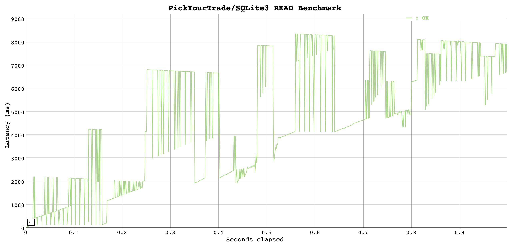
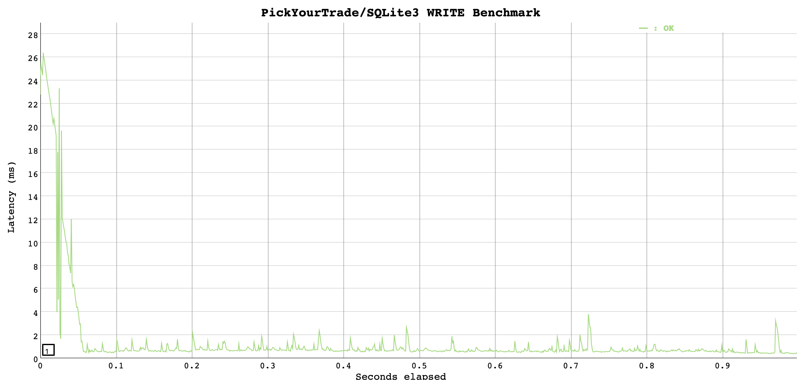

# 💰 PickYourTrade
A portfolio tracker built on Node, Vue & SQLite3.

// TODO: screencast GIF with Gifox.

## ⚙️ Setup

### Quick-Start

Just paste these into your terminal console (you can substitute `npm` with `yarn` if you'd like).

1. `git clone git@github.com:paambaati/pickyourtrade.git`
2. <details>
        <summary>Docker</summary>

        docker-compose up --build
        # Now open http://localhost:2000
    </details>

    <details>
        <summary>Non-Docker</summary>

        cd pickyourtrade/app && npm install && npm run serve
        # Open a new terminal
        cd pickyourtrade/server && npm install && npm run debug
        # Now open http://localhost:8080
    </details>

### Running Tests

1. `cd pickyourtrade/app && npm test`
2. `cd pickyourtrade/server && npm test`

### Developer Notes

Note that the tests are not extensive. The current test suite covers all aspects of testing a Vue app, so it can be used as boilerplate to finish up the rest.

## 👩🏻‍💻 Technology Choices

### Why Node.js?

1. Fully non-blocking & asynchronous.
2. Not a CPU-intensive workload.
3. Easy of use and wealth of community packages (for example, we use [Koa](https://koajs.com/) for the core API server).
4. Same language as the frontend!

### Why SQLite3?

1. Embeddable, so portable and no additional setup.
2. Very fast and capable <sup id="a1">[[1]](#f1)</sup><sup id="a2">[[2]](#f2)</sup> for simple workloads (all the app uses is `SELECT` &amp; `INSERT`).
3. Has an in-memory mode too, which is _much_ faster than disk-backed mode.
4. The database size is relative small (a million portfolio records occupies ~120MB of disk space).

## 📈 Scale

The current version of the app is built on Node.js for the backend API, and uses SQLite3 for the database.

### Benchmarks

[`vegeta`](https://github.com/tsenart/vegeta#limitations) was used to benchmark a cold-started version of the app running SQLite in disk-mode. Write benchmark tries to send 1k `PUT` requests (1k `INSERT`s), and the read benchmark tries to send 1k `GET` requests (1k `SELECT`s) on sample data of 100 records.

The benchmarks can be recreated with [`benchmarks/run.sh`](https://github.com/paambaati/pickyourtrade/blob/master/benchmarks/run.sh).

```
INSERT Benchmark Results

Requests      [total, rate]            1000, 1001.06
Duration      [total, attack, wait]    999.401273ms, 998.943484ms, 457.789µs
Latencies     [mean, 50, 95, 99, max]  1.273438ms, 519.687µs, 3.201523ms, 22.237725ms, 24.941809ms
Bytes In      [total, mean]            0, 0.00
Bytes Out     [total, mean]            285000, 285.00
Success       [ratio]                  100.00%
Status Codes  [code:count]             200:1000
```

```
READ Benchmark Results

Requests      [total, rate]            1000, 1001.07
Duration      [total, attack, wait]    8.917441283s, 998.930366ms, 7.918510917s
Latencies     [mean, 50, 95, 99, max]  4.807794447s, 4.746398003s, 8.281871586s, 8.332671972s, 8.34698592s
Bytes In      [total, mean]            0, 0.00
Bytes Out     [total, mean]            0, 0.00
Success       [ratio]                  100.00%
Status Codes  [code:count]             200:1000
```

READ Benchmark (Disk)      |  WRITE Benchmark (Disk)
:-------------------------:|:-------------------------:
 | 

These numbers show that the current version of the app _can_ scale to 1000 concurrent users.

### Scaling Beyond 1k Users

Before we scale-up this solution, we'll need some numbers around usage characteristics —

1. Is the app read-heavy or write-heavy?
2. Do the read and write times deteriorate over time with more users onboarded? If yes, by how much? How many of the users are impacted by this? This is where baseline and periodic performance metrics help.
3. What is the average size of a single row of data? What is the average size of a user's portfolio (`average row size * no. tickers average user has`)?
4. What kind of data can be cached? If there's candidates for caching, it might be worthwhile building a cache layer (perhaps a in-memory cache or a lean K-V store like Redis).

With these numbers in place, we can then try to find performance bottlenecks. Possible bottlenecks are —

| **Bottleneck** | **Causes** | **Solutions** |  |  |
|---------------------------------|--------------------------------------------------------------------------------------------------------------------------------------|---------------------------------------------------------------------------------------------------------------------|---|---|
| Slow DB read/writes. | 1. Slow disk. 2. Low free RAM (only in memory mode). | 1. Upgrade to SSD/NVMe/IOPS-optimized storage. 2. Upgrade RAM. |  |  |
| Too many open HTTP connections. | 1. Long-running connections. 2. Too few open handles. | 1. Identify root cause for long-running connections and fix them. 2. Fine-tune `sysctl`. |  |  |
| Memory leaks. | 1. Too many global variables. 2. Very big closures that cannot be GC'ed fast enough. 3. Unbound collections that can grow unchecked. | 1. Avoid global variables. 2. Use closures sparingly. 3. Always set upper bounds for any collection data structure. |  |  |
| Segmentation faults and/or crashes. | 1. V8 is running out of memory to use, as it it's heap size is limited 1GB on 64-bit systems. | 1. Tune [`--max-old-space-size`](https://nodejs.org/api/cli.html) to make sure V8 can use all available RAM. |  |  |
| Very high response latency and/or connection drops. | 1. User's data has grown too big. | 1. Lazy load (i.e. paginate data) on the frontend. |  |  |

🚩 Some of the causes & solutions might be specific to Node.js.

#### Horizontal Scaling & Choice of Database

Note that most of the solutions discussed above are to vertically scale the app. In most cases however, the database is the biggest bottleneck of any app. As the app's userbase scales rapidly, it might be considering a **distributed** database. Based on the app usage metrics and our performance baseline metrics, an appropriate database can be chosen to replace SQLite; any database that can provide easy replication would let us horizontally scale.

📣 A _personal_ recommendation would be [RethinkDB](https://www.rethinkdb.com/) — it is built from the ground-up for the real-time web (especially great for streaming data), and so would be a great match to build more features like a live updating ticker<sup id="a3">[[3]](#f3)</sup>. Out of the box, it has sharding/replication, fantastic documentation, a very well thought-out admin UI and a fun query language<sup id="a4">[[4]](#f4)</sup> that feels great to use in JS-land.

## 📝 Footnotes

<b id="f1">1</b> [What are the performance characteristics of SQLite with very large database file?](https://stackoverflow.com/questions/784173/what-are-the-performance-characteristics-of-sqlite-with-very-large-database-file). [↩](#a1)

<b id="f2">2</b> [SQLite Limits](https://www.sqlite.org/limits.html). [↩](#a2)

<b id="f3">3</b> [RethinkDB Changefeeds](https://www.rethinkdb.com/docs/changefeeds/javascript/). [↩](#a3)

<b id="f4">4</b> [ReQL Ten-minute guide](https://www.rethinkdb.com/docs/guide/javascript/). [↩](#a4)
